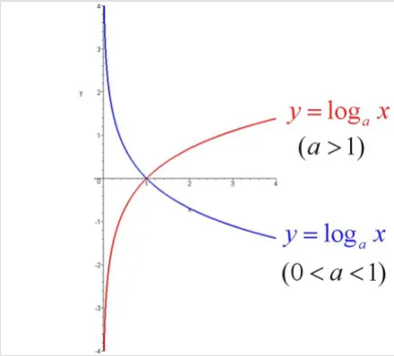

### 对数函数
1. Concept  
如果a^Y = X（a>0，且a≠1），那么数Y叫做以a为底X的对数，记作y=logaX，读作以a为底X的对数，其中a叫做对数的底数，X叫做真数。  
2. 其中x是自变量，函数的定义域是（0，+∞），即x>0
3. 通常我们将以10为底的对数叫`常用对数`（common logarithm），并把log10X记为lgX
4. 另外，在科学计数中常使用以无理数e=2.71828···为底数的对数，以e为底的对数称为`自然对数`（natural logarithm），并且把logeN 记为ln N  
5. 在实数范围内，负数和零没有对数；log以a为底1的对数为0（a为常数） 恒过点（1，0）。

函数图表形式如下：

落实到评估算法的时间/空间复杂度，我们参考的一定是上图中红色曲线，因为算法复杂度一定是随着X（数据规模）的增大而增大，不可能减小哈哈。

##### 对数函数与指数函数的关系
a^Y = X 和 Y=logaX 是相反的关系，从函数的写法也能看的出来，两者当中a都是作为底，但x和y的位置（自变量和因变量）是相反的

### 常见复杂度
O(1), O(logn), O(nlogn), O(n^2)