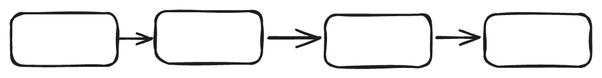

### 没有dummyHead的情况下对单链表进行新增操作
以下使用伪代码表示

1. 在头部增加节点
```go
type Node struct {
    next *Node
    val  int
}
```


```go
newNode := new(Node{next:head})
head = newNode
```


2. 在尾部增加节点
// 首先需要经过O(n)遍历到链表尾部
```go
cur := head
for i:=0;i<l.len-1;i++ {
    cur = cur.next
}
newNode := new(Node{next:nil})
cur.next = newNode
```

3. 在中间增加节点（指定index位置之前插入节点）

// 以下代码不适用于index = 0的情况，即不适合用于在头结点前插入节点,当index=0时，index-1 = -1,代码不会进入for循环。  
// 即使当index = 0时能进入for循环，处理的逻辑也与步骤1 不一样。

```go
newNode := new(Node{})
cur := head
for i:=0;i<index-1;i++ {
    cur = cur.next
}
// 此时的cur就是index之前的那个节点
cur.next = new(Node{next:cur.next.next,val:val})
```

### 有dummyHead的情况下对单链表进行新增操作
```go
cur := dummyHead
for i:=0;i<index;i++ {
    cur = cur.next
}
// 遍历完成之后，cur就是index之前的那个节点
// 不需要对针对头节点做专门处理

cur.next = new(Node{next:cur.next.next,val:val})
```


### 关于for循环中的index定位问题

1. 没有dummyHead的情况下：

```go
cur := head
for i:=0;i<index;i++ {
    cur = cur.next
}
```
// 此时for循环完成后，cur是index位置的节点

2. 有dummyHead的情况下：

```go
cur := dummyHead
for i:=0;i<index;i++ {
    cur = cur.next  
}
```

// 此时for循环完成后，cur是index位置之前的那个节点